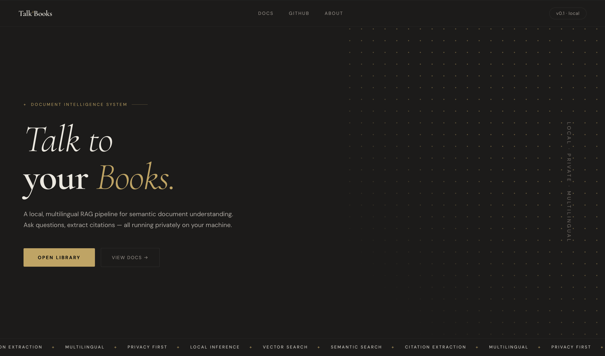
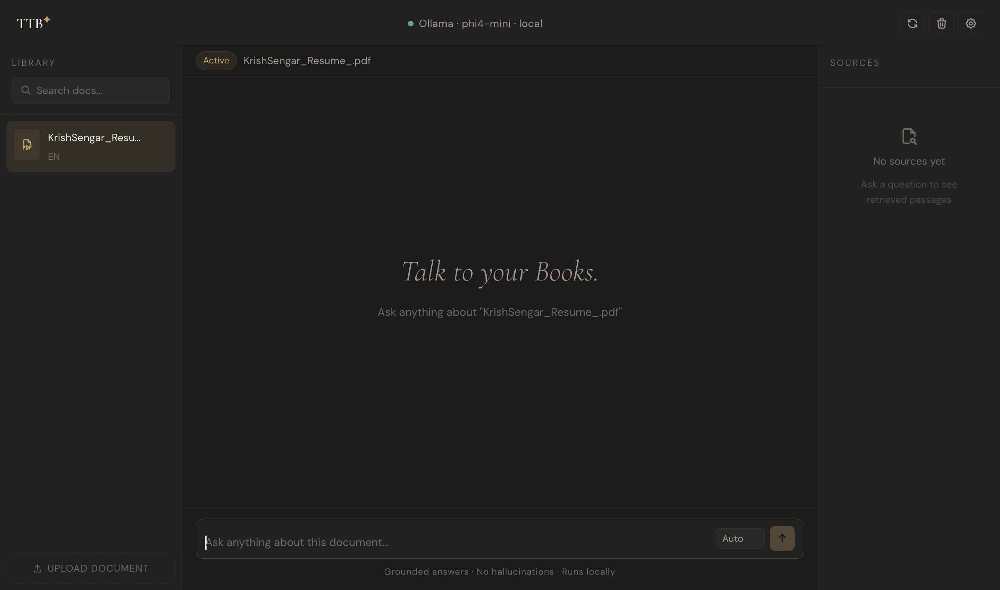

# Talk²Books

> A fully local, multilingual RAG document assistant. Upload any PDF, Word file, or text document and ask questions in English, Hindi, Punjabi, or Sanskrit — all running privately on your machine. No cloud. No API keys. Zero data leaves your device.


---

## What is Talk²Books?

Talk²Books is an AI-powered document Q&A system built on RAG (Retrieval-Augmented Generation). Instead of asking a general-purpose AI that might hallucinate, Talk²Books searches your actual documents for the most relevant passages, then uses a local language model to generate a grounded, cited answer.

**The key difference from cloud-based tools:** everything — the AI model, the vector database, the embedding model, and the web server — runs on your own machine. Your documents never leave your device.

---

## Features

- **Document Upload** — PDF, DOCX, TXT, and CSV support
- **Semantic Search** — finds relevant passages by meaning, not just keywords
- **Grounded Answers** — AI answers are based strictly on your document content
- **Source Citations** — every answer links to the exact passages used
- **Multilingual** — query in English, Hindi, Punjabi, or Sanskrit with auto-detection
- **Per-Document Filtering** — questions only search the document you have selected
- **Chat Persistence** — conversation history saved per document across page refreshes
- **Document Management** — upload, search, and delete documents from the library
- **System Info Modal** — live status of all local services at a glance
- **Zero Cloud Dependency** — fully private, offline-capable after initial setup

---

## Demo

| Landing Page | Chat Interface |
|---|---|
|  |  |

> *Screenshots: dark editorial UI with Cormorant Garamond + DM Sans typography*

---

## Tech Stack

| Layer | Technology | Purpose |
|---|---|---|
| Frontend | React 18 + Vite | Three-panel chat UI |
| Backend | Python + Quart | Async REST API |
| Vector DB | Qdrant (local) | Semantic search |
| LLM | Ollama + phi4-mini | Local answer generation |
| Embeddings | all-mpnet-base-v2 | 768-dim text vectors |
| Pipeline | LangChain | Document loading and chunking |
| PDF Parsing | PyMuPDF | Clean extraction from complex layouts |
| Language | langdetect | Auto language identification |
| Markdown | react-markdown | Formatted AI responses |

---

## Architecture

```
┌─────────────────────────────────────────────────────────┐
│                    React Frontend (port 3000)            │
│   Library Panel │ Chat Panel │ Sources Panel            │
└────────────────────────┬────────────────────────────────┘
                         │ /api/* (Vite proxy)
┌────────────────────────▼────────────────────────────────┐
│                  Quart Backend (port 5000)               │
│   /api/health   /api/documents   /api/query             │
│   /api/upload   /api/documents/<id> (DELETE)            │
└──────────┬──────────────────────────┬───────────────────┘
           │                          │
┌──────────▼──────────┐  ┌───────────▼───────────────────┐
│   Qdrant (port 6333)│  │    Ollama (port 11434)         │
│   Vector storage    │  │    phi4-mini LLM               │
│   Metadata filters  │  │    Local inference             │
└─────────────────────┘  └───────────────────────────────┘
           ▲
┌──────────┴──────────┐
│  HuggingFace Models │
│  all-mpnet-base-v2  │
│  768-dim embeddings │
└─────────────────────┘
```

### How a Query Works

1. User asks a question in the chat
2. Question is converted to a 768-dim vector (same model used at ingest)
3. Qdrant finds the 5 most similar document chunks using cosine similarity
4. Chunks are filtered by active document and detected language
5. Top chunks + question are assembled into a structured prompt
6. phi4-mini generates a grounded answer from the prompt
7. Answer + top 3 source passages returned to the frontend

---

## Prerequisites

Make sure the following are installed before setup:

| Requirement | Version | Install |
|---|---|---|
| Python | 3.11+ | [python.org](https://python.org) |
| Node.js | 18+ | [nodejs.org](https://nodejs.org) |
| Ollama | latest | [ollama.com](https://ollama.com) |
| Qdrant | latest | [qdrant.tech](https://qdrant.tech) |

---

## Setup

### 1. Clone the repository

```bash
git clone https://github.com/KrishO2O2/Talk2Books.git
cd ttb
```

### 2. Start Qdrant

```bash
# Using Docker (recommended)
docker run -p 6333:6333 qdrant/qdrant

# Or download the binary from https://qdrant.tech/documentation/quick-start/
```

### 3. Pull the language model

```bash
ollama pull phi4-mini
```

### 4. Set up the Python backend

```bash
cd backend

# Create and activate a virtual environment
python -m venv venv

# Windows
venv\Scripts\activate

# macOS / Linux
source venv/bin/activate


# Install dependencies
pip install -r requirements.txt
```

### 5. Set up the React frontend

```bash
cd frontend
npm install
```

---

## Running the App

Open three terminal windows:

**Terminal 1 — Qdrant** (if not using Docker auto-restart)
```bash
# Already running if you used Docker above
```

**Terminal 2 — Backend**
```bash
cd backend
source venv/bin/activate
python app.py
# Server starts on http://localhost:5000
```

**Terminal 3 — Frontend**
```bash
cd frontend
npm run dev
# App opens on http://localhost:3000
```

Open [http://localhost:3000](http://localhost:3000) in your browser.

---

## Ingesting Documents via CLI

You can pre-ingest documents from the command line before using the UI:

```bash
cd backend
source venv/bin/activate

# Place documents in the data/ folder, then run:
python ingest.py

# Or specify a custom folder:
python ingest.py --data-dir /path/to/documents
```

Supported formats: `.pdf`, `.docx`, `.txt`, `.csv`

---

## Configuration

Key settings in `backend/rag_chain.py`:

```python
EMBEDDING_MODEL = "sentence-transformers/all-mpnet-base-v2"  # 768-dim
OLLAMA_MODEL    = "phi4-mini"        # swap for "llama3" on better hardware
TOP_K           = 5                  # chunks retrieved per query
COLLECTION_NAME = "ttb_documents"    # Qdrant collection name
```

Key settings in `backend/ingest.py`:

```python
CHUNK_SIZE    = 500   # characters per chunk
CHUNK_OVERLAP = 50    # overlap between adjacent chunks
```

### Using a better model

If you have more RAM (8GB+), swap phi4-mini for a larger model:

```bash
ollama pull llama3
```

Then in `rag_chain.py`:
```python
OLLAMA_MODEL = "llama3"
```

Restart the backend — no other changes needed.

---

## Project Structure

```
ttb/
├── backend/
│   ├── app.py           # Quart API server (4 endpoints)
│   ├── rag_chain.py     # RAG pipeline: embed → retrieve → generate
│   ├── ingest.py        # Document loading, chunking, and Qdrant upsert
│   ├── data/            # Uploaded documents stored here
│   └── tests/
│       ├── test_ingest.py
│       └── test_rag_chain.py
│
├── frontend/
│   └── src/
│       ├── app.jsx          # Main chat UI (three-panel layout)
│       ├── LandingPage.jsx  # Landing page with About modal
│       └── index.css        # Design system and component styles
│
└── README.md
```

---

## API Reference

| Method | Endpoint | Description |
|---|---|---|
| GET | `/api/health` | Backend, Qdrant, and Ollama status |
| GET | `/api/documents` | List all ingested documents |
| POST | `/api/documents` | Upload and ingest a new document |
| DELETE | `/api/documents/<id>` | Remove document from library and Qdrant |
| POST | `/api/query` | Ask a question, returns answer + sources |

**Query request body:**
```json
{
  "question": "What are the main findings?",
  "doc_id": "research_paper.pdf",
  "language": "en",
  "filter_language": true
}
```

---

## Multilingual Support

Talk²Books supports four languages with automatic detection:

| Language | Script | ISO Code |
|---|---|---|
| English | Latin | `en` |
| Hindi | Devanagari | `hi` |
| Punjabi | Gurmukhi | `pa` |
| Sanskrit | Devanagari | `sa` |

**Auto mode** (default): language is detected from the question text using langdetect.

**Manual mode**: select EN / HI / PA / SA from the dropdown to override detection.

> **Note:** Cross-lingual Q&A (e.g. Hindi question on English document) requires a larger model. phi4-mini works best when the question and document are in the same language.

---

## Running Tests

```bash
cd backend
source venv/bin/activate

# Run all tests
pytest tests/

# Run with verbose output
pytest tests/ -v
```

Tests use mocking — Qdrant and Ollama do not need to be running.

---

## Roadmap

- [ ] Streaming responses (word-by-word generation)
- [ ] Upload progress indicator for large files
- [ ] Export chat as PDF with source citations
- [ ] Multiple document collections / project spaces
- [ ] Support for larger models (Llama 3, Mistral)

---

## Acknowledgements

Built during a summer internship at the **Indian Institute of Technology Ropar** under the guidance of **Dr. Balwinder Sodhi**, Department of Computer Science and Engineering (May–July 2026).

---

## License

AGPL-3.0 License — see [LICENSE](LICENSE) for details.

---

<p align="center">
  <strong>Talk²Books</strong> · Local · Private · Multilingual
</p>